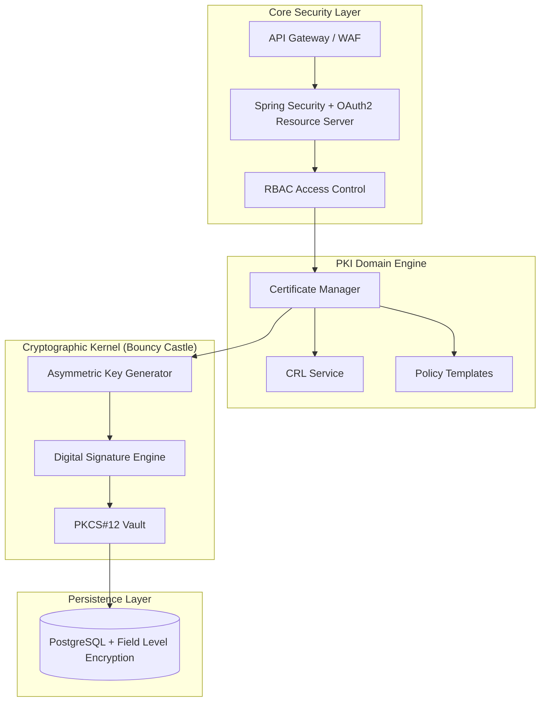

<div align="center">
  
  
  <br>

  <h1 style="font-size: 3em; margin-bottom: 0;">Sentinel PKI Ecosystem</h1>
  <h3 style="font-weight: 400; color: #555; margin-top: 0;">Next-Generation Digital Identity & Zero-Knowledge Trust Infrastructure</h3>

  <p>
    
    
    
    
  </p>

  <p align="center" style="max-width: 800px; margin: auto; line-height: 1.6;">
    <strong>Sentinel PKI is a military-grade security framework designed to establish a Root of Trust within enterprise environments. 
    It orchestrates the complete lifecycle of digital certificates and implements a Zero-Knowledge architecture for secure credential sharing, strictly adhering to X.509 standards.</strong>
  </p>

  <p>
    <a href="pki_spec.pdf"><strong>📄 Read the full Specification (PDF) »</strong></a>
    <br>
    <a href="#system-architecture-and-crypto-agility"><strong>🏛 System Architecture »</strong></a>
    ·
    <a href="#certificate-authority-ca-engine"><strong>🔐 CA Engine »</strong></a>
    ·
    <a href="#zero-knowledge-password-vault"><strong>🛡 Zero-Knowledge Vault »</strong></a>
  </p>
</div>

<br>

---

## Executive Summary

**Sentinel PKI** addresses the fundamental challenge of trust in distributed systems. Unlike basic certificate generators, this system functions as a fully compliant **Certificate Authority (CA)** capable of enforcing hierarchical trust chains (Root $\rightarrow$ Intermediate $\rightarrow$ End-Entity).

Beyond PKI, the system introduces a **Cryptographic Credential Vault**. By leveraging the user's existing asymmetric keys (RSA/EC), it solves the secure password sharing problem using an **Asymmetric Key Wrapping protocol**. This ensures a **Zero-Knowledge Architecture**, where the server acts as a blind storage provider, mathematically incapable of accessing the raw secrets it hosts.

---

## System Architecture and Crypto-Agility

The system is engineered on **Spring Boot 3** using a **Hexagonal Architecture** approach. This strict separation of concerns ensures that the Cryptographic Kernel remains decoupled from the Business Logic and REST Adapters, allowing for future algorithm agility (e.g., swapping RSA for PQC).



### Key Engineering Decisions
*   **Cryptographic Abstraction:** Direct integration with the **Bouncy Castle Provider** enables low-level manipulation of ASN.1 structures and support for advanced algorithms beyond the standard Java Cryptography Architecture (JCA).
*   **Master Key Enveloping:** To prevent key leakage, all underlying PKCS#12 keystore passwords are encrypted using a system-wide **Master AES-256 Key**, managed via environment-injected secrets (simulating HSM integration).
*   **Recursive Trust Validation:** The validation logic employs a depth-first recursive algorithm to traverse and verify the entire certificate chain up to the trusted Root CA anchor.

---

## Certificate Authority (CA) Engine

This module serves as the backbone of the infrastructure, managing the issuance and lifecycle of digital identities.

### Advanced Certificate Lifecycle
1.  **Hierarchical Issuance Logic:**
    *   **Root CA:** Supports self-signed bootstrapping, simulating air-gapped root logic.
    *   **Intermediate CA:** Authorized to sign sub-certificates, allowing for departmental delegation of trust.
    *   **End-Entity (EE):** Leaf certificates restricted from further signing via `BasicConstraints`.
2.  **Policy Enforcement via Templates:**
    *   Implements pre-configured profiles (e.g., *Web Server SSL*, *Code Signing*) that enforce strict **Key Usage (KU)** and **Extended Key Usage (EKU)** extensions to prevent privilege escalation attacks.
3.  **Cascading Revocation:**
    *   Implements integrity checks where revoking an Issuer Certificate automatically triggers the invalidation of its entire descendant subtree.
    *   Generates cryptographically signed **Certificate Revocation Lists (CRL)** for offline verification.

### CSR and Interoperability
*   The system parses and validates **PKCS#10 Certificate Signing Requests (CSR)** in PEM format.
*   Enforces strict Regex validation on Subject Distinguished Names (DN) to maintain organizational naming standards.

---

## Zero-Knowledge Password Vault

This module implements an **End-to-End Encrypted (E2EE)** sharing protocol based on the **Hybrid Encryption Scheme** (also known as a Digital Envelope). This ensures secure exchange of secrets of any size without relying on a shared symmetric key or server-side trust.

### The Hybrid Encryption Protocol
1.  **Ephemeral Key Generation:** For every secret, the client generates a strictly random, one-time **256-bit AES Key** (Session Key).
2.  **Data Encryption:** The actual payload (password/document) is encrypted using this AES Key (ensuring high performance and arbitrary data size).
3.  **Key Wrapping:** The AES Session Key is then encrypted (wrapped) using the recipient's **X.509 Public Key** (RSA/EC) fetched from the PKI.
4.  **Storage:** The server stores the packet containing `{Encryptedpayload + EncryptedSessionKey}`.
5.  **Decryption:** The recipient uses their **Private Key** to unwrap the AES Session Key, and then uses that key to decrypt the payload.

> **Security Guarantee:** The server never sees the AES Session Key in plain text. Since the private keys are strictly confined to the user's keystore, the backend infrastructure is mathematically incapable of decrypting the stored secrets.

---

## Security Compliance (DevSecOps)

The application architecture follows **OWASP** best practices and strict defensive programming principles.

| Defense Mechanism | Implementation Detail |
| :--- | :--- |
| **Non-Repudiation** | Immutable audit trails record every signing event, revocation, and access attempt. |
| **Session Hardening** | JWT-based state management with active session fingerprinting (IP/User-Agent binding) to detect token theft. |
| **Input Sanitization** | rigorous validation of ASN.1 structures and X.500 names to prevent Injection attacks. |
| **Secure Storage** | Private keys encapsulated in **PKCS#12** containers; metadata encrypted via **AES-256**. |
| **Dependency Scanning** | Integrated vulnerability analysis (SonarQube/Snyk) to mitigate supply chain risks. |

---

## Technology Stack

*   **Core Framework:** Spring Boot 3 (Java 17)
*   **Cryptographic Provider:** Bouncy Castle (BC)
*   **Security Standard:** Spring Security 6 (OAuth2 Resource Server)
*   **Database:** PostgreSQL (Transactional ACID compliance)
*   **Build System:** Maven

---

## Deployment and Initialization

```bash
# Clone the repository
git clone https://github.com/bteodora/pki-management-system.git

# Bootstrap the Root of Trust (Initial CA Generation)
./mvnw spring-boot:run -Dspring-boot.run.arguments=--init-root

# Access the Secure API Documentation
open https://localhost:8443/swagger-ui.html
```
